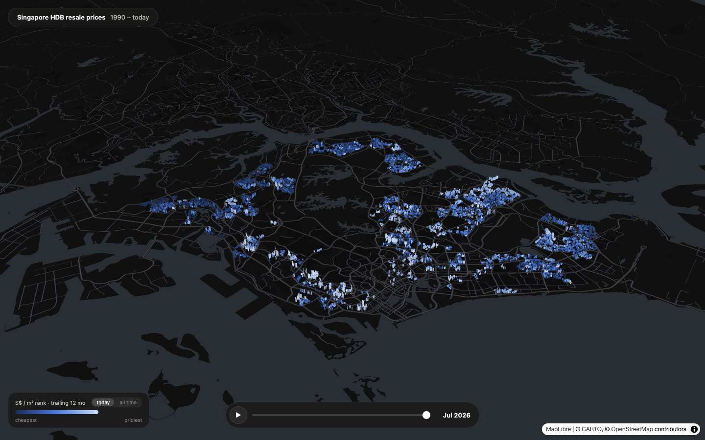
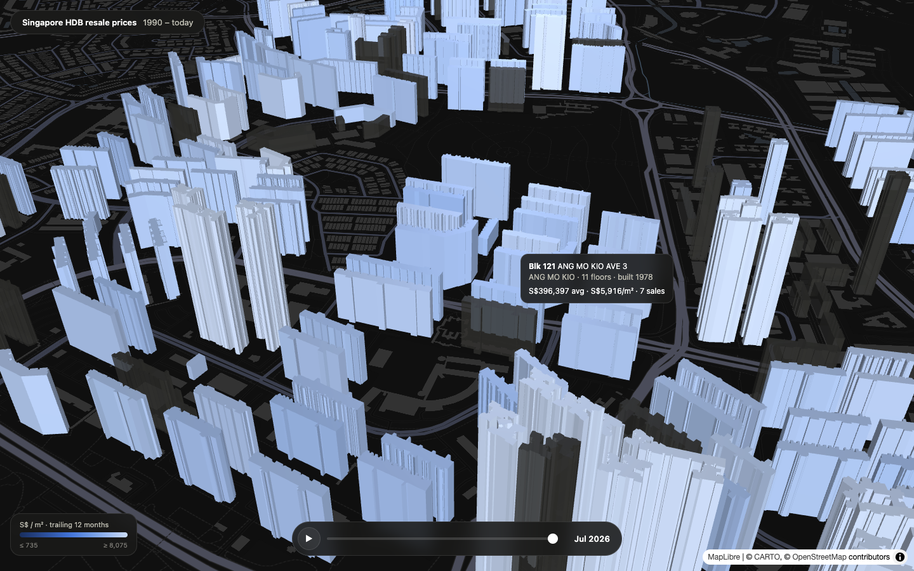

# everyblock

Every HDB resale transaction since 1990, nearly a million sales, on an explorable 3D map of Singapore. Scrub through 36 years and watch estates rise out of empty land. Click any block for its own price history. Ask the search box a question.

**Live demo:** [everyblock.sg](https://everyblock.sg)



## What it does

- **Time machine.** A scrubber sweeps Jan 1990 to the present. Buildings appear the year they were completed: play from the start and watch Sengkang and Punggol materialize. Era captions narrate the story as it plays: the 90s boom, the Asian Financial Crisis, the first million-dollar flat, the COVID surge.
- **Real buildings.** 9,787 actual HDB footprint polygons extruded at their real floor counts, not abstract markers.
- **Every block has a stock chart.** Click a block: a 36-year price sparkline, remaining lease, a floor-by-floor price breakdown, and its complete resale ledger. Select a block and it opens as a wireframe cutaway with one colored plate per floor band that traded.
- **Ask questions.** The search box answers "highest price for a flat in jurong in 2026" or "4 room under 600k in punggol" with a deterministic parser. No LLM, no API key, works offline.
- **Everything is a link.** Camera, month, color mode, and selected block all live in the URL. Share a moment, not a homepage.



## Run it

Requires [bun](https://bun.sh). The processed dataset ships in `data/out/`, so the viewer works immediately:

```
cd viewer
bun install
bun run dev
```

## Rebuild the data from source

```
bun scripts/01-download.ts    # 5 HDB resale CSVs (1990 to present) + property info, from data.gov.sg
bun scripts/02-merge.ts       # normalize into transactions.ndjson + unique addresses
bash scripts/run-geocode.sh   # resolve all addresses (OneMap + footprint propagation)
bun scripts/04-build.ts       # emit data/out/{buildings.json, transactions.bin, meta.json}
```

No API keys needed anywhere. The only rate-limited step is geocoding, and it needs far fewer calls than you would expect, for a slightly interesting reason:

**The geocoding trick.** OneMap throttles by holding connections open rather than returning errors, so geocoding ~10k addresses naively takes hours. But the HDB Existing Building GeoJSON keys every footprint by block number, SLA street code, and a unique postal code. OneMap results include postal codes. So one OneMap lookup per street teaches that street's SLA code, and every other block on the street then resolves offline through the footprint file. Around 600 API calls instead of 10,000, and the map gets real building footprints as a side effect.

## Output format

- `buildings.json` — one entry per block: position, footprint polygon, max floor level, year completed, dwelling units, postal code
- `transactions.bin` — 968,161 transactions as columnar little-endian typed arrays (layout in `meta.json`), loaded zero-copy in the browser
- `meta.json` — column layout, enum tables, month range, pipeline stats

Remaining lease is derived as `lease_start + 99 - sale_year`. Storey values are band midpoints as published by HDB ("10 TO 12" becomes 11).

## Stack

Vite, MapLibre GL (CARTO dark basemap), deck.gl for the extrusions, no framework, no backend. The full dataset loads client-side (~32 MB) and every interaction, including the question answering, runs in the browser.

## Data sources and attribution

- [HDB resale flat prices](https://data.gov.sg/collections/189/view), [HDB property information](https://data.gov.sg/datasets/d_17f5382f26140b1fdae0ba2ef6239d2f/view), and [HDB Existing Building](https://data.gov.sg/datasets/d_16b157c52ed637edd6ba1232e026258d/view) from data.gov.sg, made available under the [Singapore Open Data Licence](https://data.gov.sg/open-data-licence)
- Geocoding by [OneMap](https://www.onemap.gov.sg), © Singapore Land Authority
- Basemap © [CARTO](https://carto.com), © [OpenStreetMap](https://www.openstreetmap.org/copyright) contributors; satellite imagery © Esri, Maxar, Earthstar Geographics
- Historical context in the era captions cross-checked against the HDB Resale Price Index record

Code is MIT licensed. The data belongs to the agencies above under their respective terms.
